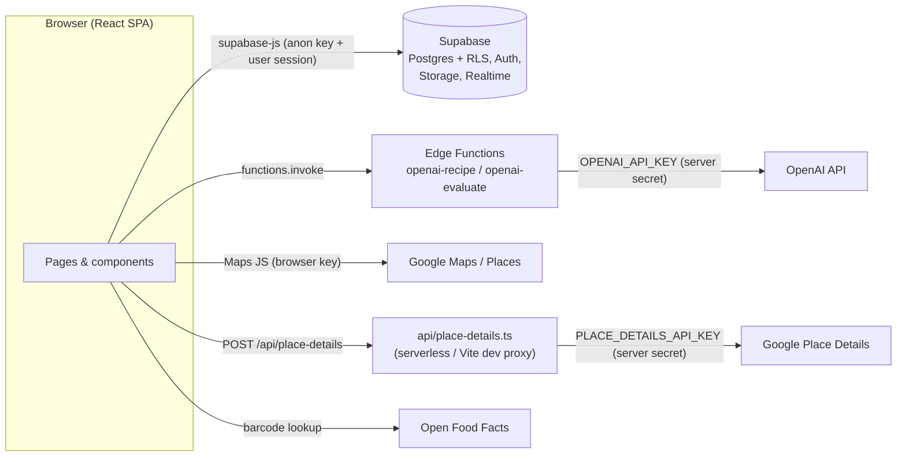

# 🥕 Food on the Table

**Reduce food waste together.** Food on the Table helps households decide what to do with food before it spoils: cook it, eat it, share it with neighbors, donate it, or compost it. Eating, donating, sharing and learning all earn impact points.


> **Status:** early-stage prototype. See [Project status](#project-status) before you rely on it.

---

## Table of contents

- [Features](#features)
- [Tech stack](#tech-stack)
- [Architecture](#architecture)
- [Getting started](#getting-started)
- [Environment variables](#environment-variables)
- [Scripts](#scripts)
- [Project structure](#project-structure)
- [Security](#security)
- [Project status](#project-status)

---

## Features

| Area | Route | What you can do |
|---|---|---|
| 🏠 **Home & triage quiz** | `/` | Answer a few questions and get a recommendation: donate, share, eat soon, use now, be cautious, or compost. The home page also shows "Use this next" items that are about to expire, plus quick actions. |
| 🧊 **My Food** | `/my-food` | Track what's in your fridge, freezer and pantry. Add items by **barcode scan** (camera + [Open Food Facts](https://world.openfoodfacts.org/)) or with a manual form that pre-fills typical shelf life. Filter by storage or expiry, bulk-delete, freeze, or mark items as eaten. |
| 🤖 **AI food check** | `/my-food` | Get an AI suggestion on whether an item is best cooked, eaten, donated or discarded, and why. If the AI service is unavailable, the app uses a simple expiry-date check instead. *Suggestions only, not food-safety advice.* |
| 🍳 **Recipe generator** | `/recipe-generator` | Drag expiring items into the *Cooking Pot* on My Food, or type ingredients in. Pick cuisine, time, diet, meal type, flavor and method, and get a full recipe. You can print or download it, and "I cooked this" removes the used items from your inventory. |
| 📍 **Donate** | `/donate` | A Google Maps view of nearby food banks, pantries, soup kitchens, shelters and community fridges, with a radius slider, filters, details (hours, phone, website) and directions. You can log a donation with a photo. |
| 🤝 **Community sharing** | `/community` | Post surplus food to **offer** to neighbors, browse offers nearby, and save the ones you like. Expressing interest opens a chat with the giver right away. The giver accepts or declines, and both sides confirm the pickup. |
| 💬 **Messages** | `/messages` | Real-time chat with unread counts, image attachments and muting. |
| 📚 **Learn** | `/learn`, `/my-collection` | Swipeable lessons and quizzes on food safety and sustainable living. You can like and save them. |
| 🌱 **Impact** | `/impact` | Points, levels (Seedling → Forest Guardian), meals saved, CO₂ avoided, money saved, badges, streaks and an opt-in leaderboard. |
| 🔔 **Notifications** | nav bell, `/settings` | Real-time alerts for interest, pickups and messages, with a toggle for each type. |
| 🔐 **Accounts** | `/auth` | Email/password or Google sign-in, with onboarding for a username and a US ZIP code. |

## Tech stack

- **Frontend:** React 18, TypeScript, Vite 5, React Router 6
- **UI:** Tailwind CSS, [shadcn/ui](https://ui.shadcn.com/) (Radix UI), Framer Motion, Lucide icons, Recharts
- **Data:** TanStack Query, Supabase JS
- **Backend:** [Supabase](https://supabase.com/): Postgres with Row Level Security, Auth, Storage, Realtime and Edge Functions (Deno)
- **AI:** OpenAI `gpt-4o-mini`, called **only** from Supabase Edge Functions
- **Maps:** Google Maps JavaScript API + Places API
- **Barcode scanning:** ZXing + Open Food Facts

## Architecture



- **Server secrets stay off the client.** The OpenAI key lives in Supabase Edge Function secrets. The Places server key is read only by `api/place-details.ts`.
- `api/place-details.ts` is a Web-standard `Request → Response` handler. Right now only `npm run dev` serves it, through a small middleware in `vite.config.ts`. Anywhere else, the Donate details sheet falls back to basic location info.

## Getting started

### Prerequisites

- Node.js 20+ (22 LTS recommended) and npm
- A [Supabase](https://supabase.com/) project and the [Supabase CLI](https://supabase.com/docs/guides/cli)
- A Google Cloud project with **Maps JavaScript API**, **Places API (Legacy)** and **Geocoding API** enabled. See the note in [Project status](#project-status) about the legacy Places API.
- An OpenAI API key (for the recipe and food-check features)

### 1. Clone and install

```sh
git clone https://github.com/vihuynh72/food-on-the-table.git
cd food-on-the-table
npm install
```

### 2. Configure environment

```sh
cp .env.example .env
```

Fill in your own values. See [Environment variables](#environment-variables).

### 3. Set up the database

```sh
supabase login
supabase link --project-ref <your-project-ref>
supabase db push
```

> ⚠️ **A fresh `supabase db push` currently fails.** The migration history still needs cleanup:
> - Two files share the version `20251205500000`. Rename one of them.
> - `20251205500000_learn_likes_saves.sql` and `20251205600000_add_learn_content.sql` depend on tables that are only created in `20251206000000_learn_system.sql`. Move them after it.
>
> The `*.sql` files at the repo root are ad-hoc fix and diagnostic scripts from development, not a supported setup path.

In the Supabase dashboard, also:

- enable the **Google** auth provider (optional), and
- add `http://localhost:8080` and your production URL to **Auth → URL Configuration**.

### 4. Deploy the Edge Functions

```sh
supabase functions deploy openai-recipe
supabase functions deploy openai-evaluate
supabase secrets set OPENAI_API_KEY=<your-openai-key>
```

### 5. Run the app

```sh
npm run dev
```

The app runs at **http://localhost:8080**.

### Deploying

Build with `npm run build` and serve `dist/` from any static host. Configure the host to:

- set `VITE_SUPABASE_URL`, `VITE_SUPABASE_PUBLISHABLE_KEY` and `VITE_GOOGLE_MAPS_API_KEY` in its build environment. **The app shows a blank page without the Supabase variables.**
- rewrite unknown paths to `index.html`, because the app uses client-side routing.

Production hosting for `/api/place-details` is not set up yet (see [Architecture](#architecture)).

## Environment variables

| Variable | Where it's used | Public? | Purpose |
|---|---|---|---|
| `VITE_SUPABASE_URL` | browser | yes | Supabase project URL |
| `VITE_SUPABASE_PUBLISHABLE_KEY` | browser | yes | Supabase **anon** key (the legacy JWT key, not an `sb_publishable_` key, which the Edge Functions' JWT check rejects). Public by design; RLS protects data |
| `VITE_GOOGLE_MAPS_API_KEY` | browser | yes | Maps JS / Places / Geocoding. **Restrict by HTTP referrer** |
| `PLACE_DETAILS_API_KEY` | server (`api/place-details.ts`, dev proxy) | **no** | Google Place Details for the Donate details sheet. Use a separate, API-restricted key. If unset, the dev proxy falls back to the browser key |
| `VITE_PLACE_DETAILS_ENDPOINT` | browser (optional) | yes | Override the details endpoint (default `/api/place-details`) |
| `OPENAI_API_KEY` | Supabase Edge Function secret | **no** | Set with `supabase secrets set`. **Never** put it in `.env` or give it a `VITE_` prefix |

> Anything prefixed with `VITE_` is baked into the JavaScript bundle and visible to every visitor.

## Scripts

| Command | Description |
|---|---|
| `npm run dev` | Start the dev server on port 8080 (includes the `/api/place-details` proxy) |
| `npm run build` | Production build to `dist/` |
| `npm run build:dev` | Build in development mode |
| `npm run preview` | Preview the production build locally |
| `npm run lint` | Run ESLint |

## Project structure

```
├── api/
│   └── place-details.ts        # Serverless proxy for Google Place Details
├── public/                     # Static assets (favicons, robots.txt)
├── src/
│   ├── pages/                  # Route components (MyFood, Donate, Community, Learn, …)
│   ├── components/
│   │   ├── food/               # Inventory, barcode scanner, cooking pot
│   │   ├── donation/           # Donation map, search, details sheet
│   │   ├── community/          # Posts, filters, interest & pickup flows
│   │   ├── chat/               # Conversations and messages
│   │   ├── learn/              # Lesson reels and quizzes
│   │   └── ui/                 # shadcn/ui primitives + custom UI
│   ├── contexts/               # Auth/session context
│   ├── hooks/                  # Data hooks (TanStack Query + Supabase)
│   ├── lib/                    # AI edge-function client, Maps loader, impact scoring, utils
│   ├── integrations/supabase/  # Supabase client + generated types
│   └── data/                   # Food shelf-life knowledge base, sample data
└── supabase/
    ├── migrations/             # Database schema, RLS policies, RPCs, seed content
    └── functions/              # Edge Functions (openai-recipe, openai-evaluate)
```

## Security

- **Never commit `.env`.** It is git-ignored. Use `.env.example` as the template.
- Keep `OPENAI_API_KEY` and `PLACE_DETAILS_API_KEY` server-side only.
- Restrict Google API keys: HTTP referrer plus API restrictions for the browser key, API restrictions for the server key. Set quotas and budget alerts.
- The Supabase anon key is public by design. **Row Level Security policies are what protect user data**, so review them before deploying.
- Found a vulnerability? Please report it privately through GitHub's **Security → Report a vulnerability** tab instead of opening a public issue.

## Project status

This is a prototype, originally scaffolded with [Lovable](https://lovable.dev/) and developed further by hand. Known gaps:

- No automated tests or CI yet
- ESLint reports outstanding issues (mostly `any` types), and the generated Supabase types are out of date
- Migrations need consolidation (see the note in [step 3](#3-set-up-the-database))
- Donate search and details use the **legacy** Places API, which new Google Cloud projects can no longer enable. Migrating to Places API (New) is pending.
- The app targets the US (sign-up requires a 5-digit ZIP code)
- Some unused or duplicate components and pages remain from earlier iterations

No license has been chosen yet, so all rights are reserved for now. Issues and feedback are welcome.
